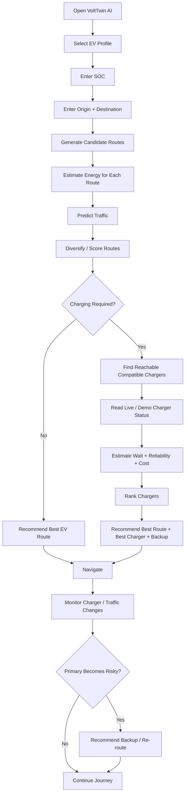

# VoltTwin AI — Product Requirements Document (PRD)

**Product:** VoltTwin AI — AI-Powered EV Mobility Platform  
**Legacy / Foundation:** Pay&Park smart parking + IoT work  
**Primary SIH Alignment:** Problem Statement 08 — EV Mobility Platform  
**Supporting Capability:** Problem Statement 05 — AI Traffic Prediction / Lightweight Digital Twin  
**Prototype Date:** 18 August 2026  
**Prototype Platform:** Web-first responsive application  
**Prototype Hardware:** NodeMCU ESP8266 + safe low-voltage/demo telemetry; optional parking occupancy/flap-lock components  
**Prototype Stack:** React + Vite + Tailwind CSS + FastAPI + SQLite + MQTT + WebSockets  
**Tagline:** **Predict Traffic. Diversify Routes. Monitor Chargers. Recommend the Best EV Journey.**

> **Branding note:** The latest visual material uses **VoltTwin AI**. Earlier source documents use **Pay&Park**. In this documentation set, VoltTwin AI is treated as the current SIH-facing product name, while Pay&Park refers to the existing smart-parking/IoT foundation that can be integrated into the platform.

---

## 1. Product Summary

VoltTwin AI is an EV mobility intelligence platform that combines:

- Battery-aware journey planning.
- EV-friendly route scoring.
- Traffic prediction.
- Capacity-aware route diversification.
- Charging-station discovery.
- Live/demo charger monitoring through IoT.
- Charger health and reliability scoring.
- Waiting-time and charging-cost estimation.
- Best-route + best-charger recommendation.
- Optional charging/parking reservation.
- Optional IoT-controlled parking access and occupancy.
- Driver and operator analytics.

The platform is designed to answer a more useful question than a normal charger locator:

> **Given my EV, current battery, destination, predicted traffic and charger condition, which route and charging option gives me the safest and most efficient overall journey?**

---

## 2. Problem Statement Alignment

### 2.1 Main problem — PS-08 EV Mobility Platform

The project primarily addresses the EV ecosystem through:

- Charging intelligence.
- Battery/SOC-aware routing.
- Charger availability and health monitoring.
- Charging recommendations.
- Waiting-time awareness.
- User experience.
- Operator analytics.
- IoT-enabled real-time visibility.

### 2.2 Supporting problem — PS-05 AI Traffic Prediction / Digital Twin

PS-05 is integrated only as a supporting intelligence layer.

The prototype may:

- Model three or more candidate routes.
- Store current traffic load.
- Predict near-future traffic load.
- Apply vehicle-class eligibility.
- Simulate route-capacity constraints.
- Compare “without diversification” vs “with diversification”.
- Recommend different suitable routes so one alternative does not become overloaded.

The prototype **does not** claim to control traffic lights, public roads, government traffic systems, or real vehicles.

---

## 3. Core User Problems

### EV drivers

1. Range anxiety.
2. Uncertainty about whether current SOC is enough.
3. Charger information may be stale or incomplete.
4. “Available” does not always mean “working or usable.”
5. Drivers may reach a charger that is occupied, faulty, offline, or incompatible.
6. Traffic increases trip time and can increase energy usage.
7. Cost, wait time, detour and charger power are often evaluated separately.
8. Charging and parking are often separate workflows.
9. Users need a backup if the preferred charger becomes unsuitable.

### Operators

1. Limited live charger visibility.
2. Faults and downtime may not be visible quickly.
3. Uneven charger utilization.
4. Limited view of demand and queues.
5. Fragmented charger, reservation, parking and telemetry data.

### Infrastructure planners

1. Limited combined visibility into traffic, charger demand and utilization.
2. Difficulty identifying potential future charging-infrastructure gaps.

---

## 4. Product Promise

**Do not just tell EV drivers where chargers are. Tell them where they can charge with confidence, which route is suitable, and what the backup should be if conditions change.**

Core decision loop:

```text
SENSE
  ↓
ANALYZE
  ↓
PREDICT
  ↓
SCORE
  ↓
RECOMMEND
  ↓
MONITOR
  ↓
BACKUP / RE-ROUTE
```

---

## 5. Product Principles

1. **EV-first:** PS-08 remains the headline.
2. **Explainable:** show why a route or charger was recommended.
3. **Truthful data:** visibly distinguish real, API, demo and simulated telemetry.
4. **Safe IoT:** never use hobby electronics directly on energized EV high-voltage paths.
5. **End-to-end over feature count:** one coherent working flow is more valuable than many disconnected screens.
6. **Graceful fallback:** hardware failure must not destroy the software demo.
7. **Modular data sources:** real sensors, OCPP/API, NodeMCU demo and software simulator must normalize into one telemetry contract.
8. **No fake AI:** rules/statistical models must be described as such.
9. **Recommendation, not road control:** traffic diversification is advisory.
10. **Measured claims only:** do not claim accuracy, time savings, reliability or emissions reductions without evidence.

---

## 6. Target Users

### P0

- EV Driver.
- Charging Station Operator.
- Admin / Hackathon Operator.

### P1 / Optional

- Parking/Charging Site Operator.
- Fleet / Commercial Driver.

### Future

- Municipal / Smart City Planner.
- Charging Network Operator.
- EV Manufacturer.
- Fleet Manager.
- Energy Provider.

See `05-User-Roles.md` for permissions and responsibilities.

---

## 7. One-Day MVP Scope

### Must work

| Capability | Requirement |
|---|---|
| EV profile | Select vehicle, battery capacity, efficiency, connector |
| SOC | User enters current battery % |
| Journey | Origin + destination |
| Route alternatives | At least 3 demo/OSM-backed routes |
| Energy estimate | Estimated kWh + arrival SOC |
| Charging need | YES / NO |
| Traffic state | Current + predicted congestion |
| Diversification | Capacity-aware route recommendation |
| Charger discovery | Candidate chargers along/near route |
| Charger states | AVAILABLE / CONNECTED / CHARGING / FAULT / OFFLINE |
| IoT telemetry | ESP8266 + MQTT or normalized fallback source |
| Reliability score | Transparent 0–100 prototype score |
| Wait estimate | Rule/statistical estimate |
| Station ranking | Cost + wait + detour + availability + reliability + power |
| Combined result | Best route + best charger + explanation |
| Backup charger | At least one alternative where available |
| Real-time UI | WebSocket updates |
| Operator view | Traffic + charger + telemetry state |
| Demo reset | Safe reset for judging |

### Strong optional features

- Demo charging reservation.
- Parking bay reservation.
- Payment simulation/sandbox.
- Smart flap lock.
- Occupancy detection.
- Charge-to-X% recommendation.
- Basic historical charts.

### Out of scope for the one-day prototype

- Nationwide production routing.
- City-scale operational digital twin.
- Control of traffic lights.
- Autonomous diversion of public traffic.
- Deep-learning traffic model.
- Production queue ML without historical data.
- Production OCPP central system unless already available.
- Direct high-voltage charger modification.
- Full fleet-management system.
- ANPR / computer vision.
- V2G / grid optimization.
- Kubernetes / multi-region architecture.
- Production payment settlement.

---

## 8. Hero User Journey



---

## 9. Major Modules

1. EV Profile & Battery Engine.
2. Smart Routing & Energy Engine.
3. Traffic Prediction / Lightweight Digital Twin.
4. Traffic Diversification Engine.
5. Charging Station Intelligence.
6. Charger Reliability Engine.
7. IoT Telemetry & Device Monitoring.
8. Recommendation Orchestrator.
9. Reservation / Parking / Access layer.
10. Analytics & Operator Dashboard.
11. Demo / Simulation Control.

Detailed implementation phases are defined in `02-Modules-and-Phases.md`.

---

## 10. Functional Requirements

### FR-001 — EV Profile

The system shall support:

- Vehicle make/model.
- Battery capacity in kWh.
- Estimated efficiency in kWh/km or Wh/km.
- Supported connector types.
- Vehicle class.
- Optional usable battery capacity.

### FR-002 — SOC

- Accept 0–100%.
- Reject invalid values.
- Calculate available planning energy.
- Apply configurable reserve.

### FR-003 — Journey Input

Accept:

- Origin.
- Destination.
- Vehicle profile.
- SOC.

Demo locations may be predefined if live geocoding is unreliable.

### FR-004 — Candidate Routes

The system shall evaluate at least three routes in demo mode.

Each route should contain:

- ID.
- Distance.
- Base ETA.
- Current traffic load.
- Predicted traffic load.
- Capacity.
- Vehicle eligibility.
- Charger candidates.

### FR-005 — Energy Estimation

MVP baseline:

```text
route_energy_kWh =
distance_km
× vehicle_efficiency_kWh_per_km
× traffic_factor
× environment_factor
```

For the one-day demo, `environment_factor` may be `1.0`.

The UI must say **estimated**.

### FR-006 — Charging Requirement

```text
available_energy =
battery_capacity × SOC

usable_for_trip =
available_energy - safety_reserve
```

If route energy exceeds usable energy, charging is required.

### FR-007 — Traffic Prediction

The prototype may use:

- Rush-hour lookup.
- Prepared historical demo data.
- Linear/regression/tree model.
- Deterministic current-load + delta logic.

The UI must not imply validated real-world prediction accuracy unless measured.

### FR-008 — Vehicle-Aware Route Eligibility

Routes may be tagged for:

- Car.
- Bike/two-wheeler.
- Truck.
- Commercial vehicle.

Ineligible routes are removed before scoring.

### FR-009 — Route Diversification

The engine must avoid recommending the same alternative to all simulated users.

Prototype logic:

1. Filter illegal/ineligible routes.
2. Calculate projected load.
3. Penalize routes near capacity.
4. Select lowest combined route cost.
5. Increment projected demand for simulation.
6. Recalculate next recommendation.

### FR-010 — What-If Digital Twin

The operator dashboard should compare:

- Baseline/no diversification.
- Diversified recommendations.

Show route load before and after.

### FR-011 — Charger Discovery

Candidates may come from:

- Seed/demo data.
- Public station API.
- Operator API.
- OCPP-backed station data.

Each record must carry source/freshness metadata.

### FR-012 — Reachability

A charger must be excluded if the EV cannot safely reach it with current energy and reserve.

### FR-013 — Compatibility

Exclude incompatible connectors or station types.

### FR-014 — Charger State Model

Supported states:

- `AVAILABLE`
- `CONNECTED_NOT_CHARGING`
- `CHARGING`
- `FAULT`
- `OFFLINE`
- `UNKNOWN`

### FR-015 — Common Telemetry

```json
{
  "charger_id": "CH001",
  "timestamp": "2026-08-18T10:05:00+05:30",
  "status": "CHARGING",
  "power_kw": 6.8,
  "voltage_v": 230,
  "current_a": 29.5,
  "energy_kwh": 3.1,
  "temperature_c": 38,
  "vehicle_present": true,
  "source_mode": "DEMO"
}
```

Fields not actually measured must be `null`/absent, not invented.

### FR-016 — Telemetry Source Modes

- `REAL`
- `OCPP`
- `DEMO`
- `SIMULATOR`

The current source mode must be visible in operator/demo UI.

### FR-017 — Charger Reliability Score

A prototype reliability score may combine:

- Current health/status.
- Recent fault rate.
- Historical successful sessions.
- Uptime/heartbeat.
- Data freshness.
- Thermal/telemetry stability where available.

Example configurable MVP score:

```text
Reliability =
0.35 × CurrentHealth
+ 0.25 × SessionSuccess
+ 0.15 × Uptime
+ 0.15 × DataFreshness
+ 0.10 × TelemetryStability
```

Rules:

- Hard `FAULT`/`OFFLINE` states override the score.
- Missing data reduces confidence.
- Score is a prototype indicator, not a certified charger-safety rating.

### FR-018 — Waiting-Time Estimate

MVP can use:

- Number of available ports.
- Active sessions.
- Average session duration.
- Simple projected arrivals.

Output must be labeled as an estimate.

### FR-019 — Station Ranking

Hard filters first:

- Reachability.
- Connector compatibility.
- Fault/offline exclusion.
- Optional booking/bay requirements.

Then score the rest.

Possible normalized score where lower is better:

```text
station_score =
wd × detour
+ ww × wait
+ wc × cost
+ wr × reliability_risk
+ wp × charging_time
+ wt × traffic_to_station
```

Weights are configurable.

### FR-020 — Combined Recommendation

Output:

- Recommended route.
- Recommended charger.
- Backup charger.
- Distance.
- ETA.
- Predicted congestion.
- Estimated energy.
- Estimated arrival SOC.
- Charger current status.
- Reliability score.
- Estimated wait.
- Estimated cost.
- Reason/explanation.
- Data source/freshness.

### FR-021 — Re-Recommendation

If the primary charger changes to a risky state during the journey:

- Re-evaluate reachable candidates.
- Preserve safety reserve.
- Prefer the best valid backup.
- Notify user.
- Do not silently change destination without showing the reason.

### FR-022 — Reservation

If enabled:

- Reserve charger/session.
- Optional parking bay.
- Prevent overlapping exclusive bookings.
- Support cancellation/expiration.

### FR-023 — Payment

For prototype:

- Sandbox or simulated flow only.
- Server owns final reservation state.
- Client-side “success” does not confirm payment by itself.

### FR-024 — Smart Parking Access

If included:

1. Reservation confirmed.
2. Backend authorizes access.
3. Expiring command is published over MQTT.
4. NodeMCU/ESP device acknowledges.
5. Flap/lock actuates.
6. Access event is logged.

### FR-025 — Occupancy

If included:

- Occupancy sensor updates bay state.
- Device heartbeat updates online/offline state.
- Sensor uncertainty must not be shown as confirmed availability.

### FR-026 — Real-Time Dashboard

WebSocket events should update:

- Charger status.
- Telemetry.
- Reliability.
- Route traffic.
- Device online/offline.
- Reservation/occupancy where enabled.

### FR-027 — Analytics

P0:

- Current charger states.
- Route congestion.
- Route diversification impact.
- Active sessions.
- Basic utilization.
- Fault/offline count.
- Telemetry freshness.

### FR-028 — Demo Controls

Admin/demo mode should allow:

- Set charger state.
- Trigger fault.
- Trigger recovery.
- Change route traffic.
- Run simulated user batch.
- Reset state.
- Switch telemetry source.

---

## 11. Non-Functional Requirements

### Performance

- Common local/demo APIs should feel immediate.
- Recommendation requests should complete within a few seconds.
- UI must show loading states for routing/external calls.

### Reliability

- MQTT reconnect.
- WebSocket reconnect.
- Heartbeat-based device offline detection.
- Software simulator fallback.
- No silent reservation confirmation on failure.

### Explainability

Every recommendation must expose major factors.

### Data freshness

Dynamic records should include timestamps and stale-state indicators.

### Security

- Auth for protected actions.
- Role-based access.
- Input validation.
- No secrets in Git.
- MQTT authentication for non-isolated deployments.
- Payment verification server-side.
- Audit logs for privileged actions.

### Safety

See `04-Safety.md`.

### Maintainability

Keep business logic out of React components; use clear backend services/modules.

### Observability

Log:

- API errors.
- Recommendation decisions.
- Score inputs.
- MQTT events.
- Device state transitions.
- Telemetry source mode.
- Reservation changes.
- Simulation actions.

---

## 12. Acceptance Scenario

The one-day prototype is acceptable when a judge can see this flow:

1. Select EV and SOC.
2. Enter trip.
3. Display three candidate routes.
4. Show current and predicted traffic.
5. Show route diversification.
6. Calculate energy and charging requirement.
7. Show candidate chargers.
8. Display charger live/demo states.
9. Recommend best route + charger + backup.
10. Trigger an IoT/demo fault on the preferred charger.
11. Dashboard updates.
12. Reliability decreases / charger becomes invalid.
13. Recommendation changes to backup.
14. Explain why the recommendation changed.
15. Optional: reserve/park/unlock/occupancy flow.

---

## 13. Success Criteria

### Must demonstrate

- Correct SOC validation.
- At least three routes.
- At least three chargers.
- Charger telemetry source labeling.
- Real-time state update.
- Explainable recommendation.
- Safe fallback when hardware is unavailable.
- Fault-aware re-recommendation.

### Claims that require measurement before presentation

- Prediction accuracy.
- Energy-estimation error.
- Percentage reduction in congestion.
- Waiting-time reduction.
- Charging-cost savings.
- Reliability percentage.
- Emission reduction.

---

## 14. Risks

| Risk | Mitigation |
|---|---|
| Real charger unavailable | Demo telemetry + software simulator |
| Unsafe measurement setup | Low-voltage demo / OCPP / qualified integration only |
| Internet failure | Local backend, local MQTT, seed data |
| Map/API failure | Predefined routes |
| AI model not ready | Transparent rule/statistical model |
| Overbuilt scope | Keep reservation/payment/parking optional |
| MQTT disconnect | Reconnect + offline state |
| Stale charger data | Timestamp + freshness warning |
| Judge questions “Is this real?” | Always show `source_mode` |
| Recommendation changes too slowly | Event-driven recompute |
| Traffic diversification misunderstood | Present as advisory simulation, not real traffic control |

---

## 15. Definition of Done

VoltTwin AI is demo-ready when:

- The frontend, backend and real-time channel run reliably.
- One ESP8266/demo source can update charger state.
- The same UI still works with the software simulator.
- A journey can be planned from EV + SOC + O&D.
- Three routes are scored.
- Traffic prediction/diversification is visible.
- Charging need is calculated.
- Candidate stations are filtered and ranked.
- A primary and backup charger are shown.
- A charger fault causes an explainable recommendation update.
- No simulated value is presented as real.
- No unsafe high-voltage wiring is used.

---

## 16. Source Grounding

This PRD consolidates the material supplied in:

- `PayPark_Complete_PRD_SIH2026.md`
- `Ev Mobility PRD(1).md`
- `EV_Charger_IoT_Backup_Options_and_Requirements (1)(1).docx`
- `EV_Charger_IoT_Backup_Options_and_Requirements(3).docx`
- `Master-Plan.txt`
- `EV-Mobility-Platform.txt`
- `Previous-Project-Context.txt`
- `Project Summary.txt`
- Supplied VoltTwin AI / EV Mobility posters, sticky-note boards and charger-monitoring visuals.
- The supplied SIH pitch text.

Where source materials differed, this documentation set follows the latest one-day-hackathon direction: **PS-08 primary, PS-05 supporting, React + FastAPI + SQLite + MQTT, NodeMCU ESP8266, safe demo fallback, and explicit source labeling.**
