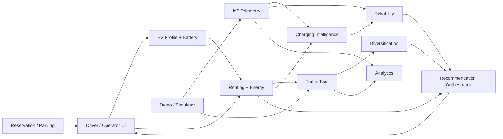

# VoltTwin AI — Modules and Phases

**Purpose:** Break the full product into independently buildable modules, with a realistic one-day hackathon phase inside each module.

Priority legend:

- **P0:** required for the main demo.
- **P1:** add only after P0 is stable.
- **P2:** future/platform scope.

---

## 1. Module Map



---

# Module 1 — EV Profile & Battery Engine

## Goal

Represent the selected EV and calculate how much energy is currently available.

## P0 — Hackathon

Build:

- Seed EV profiles.
- Battery capacity.
- Efficiency.
- Connector compatibility.
- Vehicle class.
- Current SOC.
- Configurable safety reserve.

Output:

```json
{
  "vehicle_id": "EV_NEXON_DEMO",
  "battery_kwh": 40.5,
  "soc_pct": 38,
  "available_energy_kwh": 15.39,
  "reserve_pct": 10,
  "connector_types": ["CCS2"],
  "vehicle_class": "CAR"
}
```

### Acceptance

- SOC outside 0–100 is rejected.
- Vehicle data reaches route/recommendation engine.

## P1

- Multiple saved vehicles.
- Usable battery vs nominal capacity.
- Battery health factor.
- Driver preferences.

## P2

- Connected-car API.
- Live SOC ingestion.
- Vehicle-specific charging curve.

---

# Module 2 — Routing & Energy Engine

## Goal

Evaluate candidate routes for EV feasibility.

## P0

Build at least three routes, each with:

- Distance.
- Base ETA.
- Traffic factor.
- Energy estimate.
- Arrival SOC.
- Charger candidates.

MVP formula:

```text
energy =
distance × efficiency × traffic_factor × environment_factor
```

### Acceptance

- Every route returns estimated kWh and arrival SOC.
- UI labels the estimate.
- Charging-required flag is produced.

## P1

- OSRM-backed route alternatives.
- Elevation adjustment.
- Weather adjustment.
- Better auxiliary-load model.

## P2

- Graph search with charging-state nodes.
- Vehicle-specific speed/energy curves.
- Route optimization across multiple charging stops.

---

# Module 3 — Traffic Prediction / Lightweight Digital Twin

## Goal

Show how predicted congestion changes EV route quality.

## P0

Model three or four roads/routes with:

- Capacity.
- Current load.
- Current congestion class.
- Predicted load 15–30 minutes ahead.
- Vehicle eligibility.

Prototype prediction options:

- Rush-hour lookup table.
- Rule-based delta.
- Prepared regression model.
- Prepared historical/demo dataset.

### UI

Show:

- Low.
- Medium.
- High.
- Severe.

### Acceptance

- Current and predicted load are visibly different.
- Source is labeled `DEMO` if simulated.

## P1

- Traffic API.
- Time-series history.
- Actual-vs-predicted chart.

## P2

- City-scale twin.
- Calibrated network simulation.
- External traffic authority integrations.

---

# Module 4 — Traffic Diversification Engine

## Goal

Prevent all recommendations from shifting to the same “fastest” alternative.

## P0

Algorithm:

1. Filter by vehicle class.
2. Read projected load.
3. Apply capacity threshold.
4. Penalize overloaded routes.
5. Score time + congestion + energy + capacity risk.
6. Assign route.
7. Update projected load for the next simulated request.

### Demo

Simulate, for example, 20 incoming requests:

```text
Without diversification:
Route A = overloaded

With diversification:
Cars       → Route B
Bikes      → Route C
Trucks     → Route C / approved road
Commercial → Route B/C
```

This is a **simulation/recommendation** only.

## P1

- User preference weighting.
- More vehicle classes.
- Route reservation/projected-demand windows.

## P2

- Multi-zone optimization.
- Government traffic-system integration subject to authorization.

---

# Module 5 — Charging Station Intelligence

## Goal

Find chargers that are reachable and useful for the specific trip.

## P0

Candidate station fields:

- Station.
- Distance/detour.
- Connector.
- Power.
- Price.
- Current status.
- Available ports.
- Wait estimate.
- Source mode.
- Freshness.

Hard filters:

- Reachable.
- Compatible.
- Not `FAULT`.
- Not `OFFLINE`.
- Meets minimum route constraints.

## P1

- Live station API.
- Reservation availability.
- Dynamic price.
- Amenities.
- Charge-to-X%.

## P2

- Multi-network roaming.
- Dynamic market optimization.
- Grid-aware charging.

---

# Module 6 — Charger Reliability Engine

## Goal

Answer: “Is this charger likely to be usable when the driver needs it?”

## P0

Use transparent health features:

- Current state.
- Heartbeat freshness.
- Recent faults.
- Recent successful sessions.
- Temperature stability if measured.
- Data-source confidence.

Prototype score:

```text
0–100
```

Important:

- `FAULT` or `OFFLINE` can invalidate a charger even if historical score is high.
- Score is not a certified hardware-safety score.

## P1

- Rolling 7-day / 30-day success rate.
- MTBF/MTTR-style operational metrics.
- Reliability trend.

## P2

- Predictive maintenance.
- Failure forecasting.

---

# Module 7 — IoT Telemetry & Device Monitoring

## Goal

Connect physical/demo charger state to the platform in real time.

## P0

Preferred hardware:

- NodeMCU ESP8266.
- DS18B20 temperature sensor.
- LEDs / buzzer / optional OLED.
- Safe low-voltage input/buttons.
- PZEM/energy meter only in a safe, correctly rated context.
- MQTT.

Support five source modes:

1. Full real IoT.
2. Limited IoT.
3. OCPP/API.
4. Hardware demo.
5. Software simulator.

Normalize all to the same telemetry schema.

### P0 states

- AVAILABLE.
- CONNECTED_NOT_CHARGING.
- CHARGING.
- FAULT.
- OFFLINE.

### Acceptance

- A hardware/demo state change appears on dashboard without DB editing.
- Hardware can be replaced by simulator without frontend changes.

## P1

- OCPP gateway.
- Better diagnostics.
- Retained status.
- Secure per-device ACLs.

## P2

- Managed device fleet.
- OTA.
- Production certificate lifecycle.

---

# Module 8 — Recommendation Orchestrator

## Goal

Combine route, energy, traffic and charger intelligence into one result.

## P0 inputs

- EV profile.
- SOC.
- Routes.
- Predicted traffic.
- Projected load.
- Charger compatibility.
- Charger status.
- Reliability.
- Wait.
- Cost.
- Detour.
- Charging power.

## P0 output

```json
{
  "recommended_route": "ROUTE_B",
  "recommended_charger": "CH_A",
  "backup_charger": "CH_C",
  "estimated_arrival_soc": 14.2,
  "estimated_wait_min": 8,
  "reliability_score": 94,
  "reasons": [
    "Lower predicted congestion",
    "Reachable with safety reserve",
    "Reliable charger",
    "Lower total waiting impact"
  ]
}
```

## P0 fault-aware behavior

When the preferred charger becomes faulty:

```text
IoT event
→ charger status update
→ reliability update
→ recommendation recompute
→ backup charger promoted
→ UI explanation
```

## P1

- User preference modes: Fastest / Cheapest / Most Reliable.
- Availability-at-ETA prediction.
- Charge target calculation.

## P2

- Learned ranking.
- Personalization.
- Multi-stop route optimization.

---

# Module 9 — Reservation, Payment, Parking & Access

## Goal

Connect the recommendation to a transaction and physical bay where supported.

## P0

Only if core recommendation flow is already stable:

- Demo reservation.
- Conflict prevention.
- Optional payment simulation.
- Optional bay assignment.
- Optional smart-flap unlock.
- Optional occupancy event.

## P1

- Payment sandbox/webhook.
- Reservation expiry.
- Cancellation.
- One-time access token.
- Parking session.

## P2

- Production settlement.
- Multi-operator booking.
- Roaming.
- Dynamic pricing.

---

# Module 10 — Driver UI

## Goal

Make the complex intelligence understandable in under a minute.

## P0 screens

1. Journey input.
2. Route result.
3. Charger recommendation.
4. Nearby/alternative chargers.
5. Live journey / charger monitor.

Key result card must show:

- Route.
- ETA.
- Energy.
- Arrival SOC.
- Traffic status.
- Charger.
- Availability.
- Wait.
- Reliability.
- Cost.
- Reason.
- Backup.

## P1

- Reservation/payment screens.
- Active charging session.
- History.
- Notifications.

## P2

- Mobile app.
- Connected-car experience.

---

# Module 11 — Operator Dashboard

## Goal

Make PS-05 and IoT intelligence visible to judges/operators.

## P0

Dashboard sections:

- Digital twin map.
- Route traffic colors.
- Charger status markers.
- Live telemetry.
- Reliability.
- Device heartbeat.
- Diversification before/after.
- Active sessions count.
- Faults.

## P1

- Utilization history.
- Peak hours.
- Revenue.
- Average session duration.

## P2

- Demand forecast.
- Infrastructure planning.
- New-charger placement.

---

# Module 12 — Demo & Simulation Control

## Goal

Guarantee a reliable presentation even when external dependencies fail.

## P0

Admin/demo controls:

- Reset all.
- Set Route A traffic high.
- Set Route B traffic medium.
- Trigger charger charging.
- Trigger charger fault.
- Restore charger.
- Run vehicle-request batch.
- Switch `REAL/DEMO/SIMULATOR`.
- Freeze data for screenshots.

## P1

- Scenario presets.
- Timed demo sequence.
- Replay recorded telemetry.

## P2

- Full scenario library.

---

# One-Day Cross-Module Execution Plan

## Phase 0 — 0:00–0:30

Freeze:

- Product name.
- P0 list.
- Route seed data.
- Charger seed data.
- Telemetry schema.
- API contracts.

Do not redesign after this point unless a blocker exists.

## Phase 1 — 0:30–2:30

Backend foundations:

- FastAPI.
- SQLite schema.
- Seed EV/routes/chargers.
- Journey endpoint.
- Energy calculation.
- Traffic model.

Parallel:

- React shell.
- Map/dashboard layout.
- NodeMCU firmware skeleton.

## Phase 2 — 2:30–5:00

Build intelligence:

- Traffic prediction.
- Diversification.
- Charger filters.
- Reliability.
- Station scoring.
- Combined recommendation.

Parallel:

- UI recommendation cards.
- Charger status cards.
- MQTT demo inputs.

## Phase 3 — 5:00–7:30

Real-time:

- Mosquitto.
- Paho-MQTT.
- Telemetry ingestion.
- WebSocket broadcast.
- NodeMCU/demo buttons/sensor.
- Software simulator.

## Phase 4 — 7:30–10:00

Integration:

- Journey → recommendation.
- Fault → re-recommendation.
- Traffic change → route recompute.
- Dashboard before/after.

Optional only now:

- Reservation.
- Parking.
- Payment.
- Flap lock.

## Phase 5 — 10:00–12:00+

Demo hardening:

- Local fallback.
- Seed reset.
- Test scripts.
- No-internet scenario.
- Hardware-failure scenario.
- Presentation data labels.
- Rehearsal.

---

# Build Order Rule

If time is running out, preserve this order:

1. Journey + energy.
2. Three routes.
3. Traffic prediction.
4. Charger state.
5. Recommendation.
6. Fault-aware backup.
7. Real-time dashboard.
8. Diversification.
9. Reservation.
10. Payment.
11. Parking/flap lock.
12. Extra analytics.

Never sacrifice the core end-to-end recommendation demo to finish optional transaction features.

---

## Source Grounding

This module plan is derived from the supplied consolidated PRD, master plan, IoT backup document, EV platform PRD, project context, pitch and visual architecture boards.
