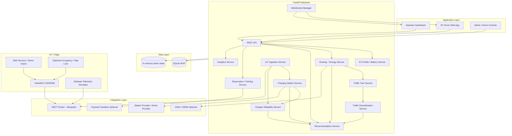
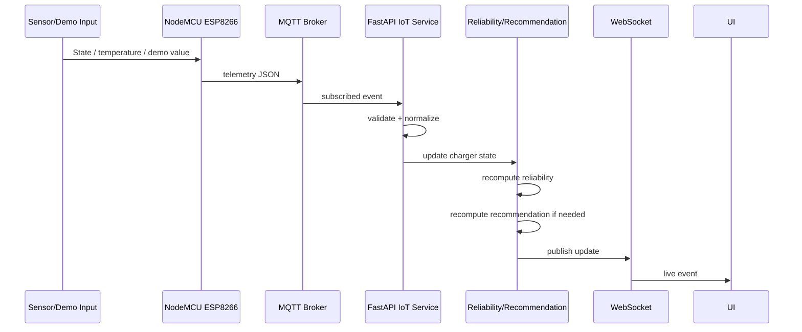

# VoltTwin AI — System Architecture

**Architecture target:** One-day hackathon MVP with a clean path to post-MVP scale.

---

# 1. Architecture Goals

1. Support the EV hero journey end to end.
2. Keep PS-05 traffic intelligence integrated but modular.
3. Accept real or simulated charger telemetry through one contract.
4. Recompute recommendations when traffic/charger state changes.
5. Keep the demo functional without internet or hardware.
6. Avoid unnecessary distributed-system complexity.
7. Make every recommendation explainable.

---

# 2. Logical Architecture



---

# 3. Frozen MVP Technology Stack

| Layer | Technology |
|---|---|
| Frontend | React + Vite |
| Styling | Tailwind CSS |
| Maps | Leaflet + OpenStreetMap |
| Charts | Recharts |
| Backend | Python + FastAPI |
| Validation | Pydantic |
| ORM | SQLAlchemy / SQLModel |
| MVP DB | SQLite |
| Real-time frontend | WebSockets |
| IoT messaging | MQTT |
| Broker | Eclipse Mosquitto |
| Python MQTT client | Paho-MQTT |
| Data/AI logic | Pandas, NumPy, Scikit-learn only where justified |
| Hardware | NodeMCU ESP8266 |
| Temperature | DS18B20 |
| Electrical telemetry | Safe rated meter/OCPP/API only |
| Version control | Git + GitHub |

Post-MVP target:

- PostgreSQL + PostGIS.
- Containerized deployment.
- Background workers if needed.
- Managed MQTT/OCPP integration.
- Redis only if a real need appears.

---

# 4. Backend Module Boundaries

Suggested repository:

```text
backend/
├── app/
│   ├── main.py
│   ├── api/
│   │   ├── journeys.py
│   │   ├── traffic.py
│   │   ├── chargers.py
│   │   ├── recommendations.py
│   │   ├── iot.py
│   │   ├── reservations.py
│   │   └── admin.py
│   ├── services/
│   │   ├── energy.py
│   │   ├── routing.py
│   │   ├── traffic_prediction.py
│   │   ├── diversification.py
│   │   ├── charger_reliability.py
│   │   ├── station_ranking.py
│   │   ├── recommendation.py
│   │   ├── telemetry.py
│   │   └── reservation.py
│   ├── models/
│   ├── schemas/
│   ├── providers/
│   │   ├── station_demo.py
│   │   ├── routing_demo.py
│   │   └── telemetry_source.py
│   ├── realtime/
│   ├── db/
│   └── config.py
├── simulator/
└── tests/
```

---

# 5. Frontend Architecture

Suggested:

```text
frontend/
├── src/
│   ├── pages/
│   │   ├── JourneyPlanner.tsx
│   │   ├── JourneyResult.tsx
│   │   ├── OperatorDashboard.tsx
│   │   └── DemoControls.tsx
│   ├── components/
│   │   ├── MapView.tsx
│   │   ├── RouteCard.tsx
│   │   ├── ChargerCard.tsx
│   │   ├── ReliabilityBadge.tsx
│   │   ├── TrafficLegend.tsx
│   │   ├── TelemetryCard.tsx
│   │   └── SourceModeBadge.tsx
│   ├── api/
│   ├── hooks/
│   ├── types/
│   └── state/
└── ...
```

Core recommendation logic stays in backend.

---

# 6. Core Data Model

## EVVehicle

```text
id
name
make
model
battery_kwh
usable_battery_kwh?
efficiency_kwh_per_km
connector_types
vehicle_class
```

## Journey

```text
id
vehicle_id
origin
destination
soc_start
created_at
status
```

## Route

```text
id
journey_id
name
distance_km
base_time_min
current_load
predicted_load
capacity
vehicle_eligibility
energy_kwh
arrival_soc
```

## ChargingStation

```text
id
name
lat
lng
route_id?
price_per_kwh?
source_mode
last_updated
```

## Charger

```text
id
station_id
connector_type
max_power_kw
status
available
last_updated
```

## ChargerTelemetry

```text
id
charger_id
timestamp
voltage_v?
current_a?
power_kw?
energy_kwh?
temperature_c?
vehicle_present?
status
source_mode
```

## ReliabilitySnapshot

```text
id
charger_id
timestamp
score
confidence
factors_json
```

## Recommendation

```text
id
journey_id
route_id
charger_id
backup_charger_id?
route_score
station_score
combined_score
explanation_json
created_at
```

## TrafficSnapshot

```text
id
route_id
timestamp
current_load
predicted_load
capacity
source_mode
```

## Reservation — optional

```text
id
user_id
charger_id
parking_bay_id?
start_time
end_time
status
```

---

# 7. REST API

## Journey

```http
POST /api/v1/journeys/plan
GET  /api/v1/journeys/{id}
```

Example request:

```json
{
  "origin": {"lat": 28.6139, "lng": 77.2090},
  "destination": {"lat": 26.9124, "lng": 75.7873},
  "vehicle_id": "EV_DEMO_01",
  "soc_pct": 38
}
```

## Traffic

```http
GET  /api/v1/traffic/routes
POST /api/v1/traffic/predict
POST /api/v1/traffic/diversify
POST /api/v1/traffic/reset-demo
```

## Chargers

```http
GET  /api/v1/chargers
GET  /api/v1/chargers/{id}
GET  /api/v1/chargers/{id}/telemetry
GET  /api/v1/chargers/{id}/reliability
```

## Recommendation

```http
POST /api/v1/recommendations/compute
GET  /api/v1/recommendations/{journey_id}
```

## IoT/Admin

```http
GET  /api/v1/iot/status
POST /api/v1/admin/demo/charger-state
POST /api/v1/admin/demo/traffic-state
POST /api/v1/admin/demo/reset
```

## Optional Reservation

```http
POST /api/v1/reservations
GET  /api/v1/reservations/{id}
DELETE /api/v1/reservations/{id}
```

---

# 8. Recommendation Response Contract

Minimum:

```json
{
  "journey_id": "J001",
  "recommended_route": {
    "route_id": "R_B",
    "distance_km": 276,
    "eta_min": 275,
    "predicted_traffic": "MEDIUM",
    "energy_kwh": 32,
    "arrival_soc_pct": 12
  },
  "charging_required": true,
  "recommended_charger": {
    "charger_id": "CH_A",
    "station_name": "EV Station Alpha",
    "status": "AVAILABLE",
    "reliability_score": 94,
    "confidence": "MEDIUM",
    "estimated_wait_min": 8,
    "detour_km": 3.2,
    "estimated_cost_inr": 312,
    "source_mode": "DEMO",
    "updated_at": "2026-08-18T10:05:00+05:30"
  },
  "backup_charger": {
    "charger_id": "CH_B",
    "station_name": "EV Station Beta"
  },
  "reasons": [
    "Lower predicted congestion",
    "Reachable with configured reserve",
    "Higher charger reliability",
    "Lower expected wait"
  ]
}
```

---

# 9. MQTT Architecture

Recommended charger topics:

```text
volttwin/chargers/{chargerId}/telemetry
volttwin/chargers/{chargerId}/status
volttwin/chargers/{chargerId}/heartbeat
```

Optional parking topics:

```text
volttwin/sites/{siteId}/bays/{bayId}/command
volttwin/sites/{siteId}/bays/{bayId}/status
volttwin/sites/{siteId}/bays/{bayId}/occupancy
volttwin/sites/{siteId}/bays/{bayId}/heartbeat
```

---

# 10. Standard Telemetry Contract

```json
{
  "charger_id": "CH001",
  "timestamp": "2026-08-18T10:05:00+05:30",
  "status": "CHARGING",
  "power_kw": 6.8,
  "voltage_v": null,
  "current_a": null,
  "energy_kwh": null,
  "temperature_c": 38.2,
  "vehicle_present": true,
  "source_mode": "DEMO"
}
```

Rules:

- `charger_id`, `timestamp`, `status` required.
- Unmeasured fields are null/omitted.
- `source_mode` required for demo/simulator.
- Backend stamps receive time separately if useful.

---

# 11. IoT Data Flow



---

# 12. Software Simulator

The simulator is a first-class architecture component.

It should be able to publish:

```text
AVAILABLE
→ CHARGING
→ AVAILABLE
→ FAULT
→ OFFLINE
→ AVAILABLE
```

Example script data:

```json
[
  {"t": 0, "status": "AVAILABLE"},
  {"t": 5, "status": "CHARGING", "power_kw": 6.8},
  {"t": 15, "status": "FAULT"},
  {"t": 25, "status": "AVAILABLE"}
]
```

Frontend should not care whether the event came from hardware or simulator.

---

# 13. Traffic Twin Architecture

Each route holds:

```text
capacity
current_load
predicted_load
vehicle_eligibility
incoming_projected_requests
```

Prediction:

```text
predicted_load =
current_load
+ rush_hour_delta
+ incoming_projected_requests
- expected_outflow
```

Diversification:

```text
filter eligible routes
→ compute projected utilization
→ apply capacity penalty
→ apply energy/time penalty
→ recommend
→ increment projected demand
```

---

# 14. Energy Architecture

MVP:

```text
available_energy_kWh =
battery_kWh × SOC / 100

route_energy_kWh =
distance_km × efficiency_kWh_per_km × traffic_factor

arrival_energy =
available_energy - route_energy
```

Planning reserve:

```text
usable_energy =
available_energy - reserve_energy
```

All factors are configuration-driven.

---

# 15. Charger Reliability Architecture

Inputs:

- Status.
- Fault history.
- Session success.
- Heartbeat uptime.
- Data freshness.
- Temperature stability.

Output:

```json
{
  "score": 94,
  "confidence": "MEDIUM",
  "factors": {
    "current_health": 100,
    "session_success": 92,
    "uptime": 96,
    "data_freshness": 100,
    "telemetry_stability": 88
  }
}
```

Fault/offline rules can invalidate the charger independently of numeric score.

---

# 16. Combined Scoring

## Route score

```text
route_score =
wt × normalized_time
+ wc × normalized_congestion
+ we × normalized_energy
+ wl × projected_load
+ wr × range_risk
```

Lower = better.

## Station score

```text
station_score =
wd × detour
+ ww × wait
+ wc × cost
+ wr × reliability_risk
+ wp × charging_time
+ wt × traffic_to_station
```

## Combined score

```text
journey_score =
route_score
+ station_score
+ charging_time_penalty
```

Weights must live in configuration.

---

# 17. Event-Driven Re-Recommendation

Triggers:

- Preferred charger → FAULT.
- Preferred charger → OFFLINE.
- Reliability falls below threshold.
- Wait jumps above threshold.
- Route predicted load crosses threshold.
- User SOC changes significantly.

Flow:

```text
event
→ update state
→ validate current plan
→ if invalid/risky: recompute
→ send recommendation_update WebSocket event
```

---

# 18. WebSocket Events

Possible events:

```text
charger.telemetry
charger.status_changed
charger.reliability_changed
traffic.updated
traffic.diversification_updated
recommendation.updated
device.offline
reservation.updated
occupancy.updated
```

Example:

```json
{
  "type": "recommendation.updated",
  "reason": "PRIMARY_CHARGER_FAULT",
  "journey_id": "J001",
  "new_charger_id": "CH_B"
}
```

---

# 19. State Machines

## Charger

```text
UNKNOWN
  ├─> AVAILABLE
  ├─> CONNECTED_NOT_CHARGING
  ├─> CHARGING
  ├─> FAULT
  └─> OFFLINE
```

## Device

```text
ONLINE
  ↓ heartbeat timeout
OFFLINE
  ↓ heartbeat restored
ONLINE
```

## Reservation — optional

```text
DRAFT
→ PENDING_PAYMENT
→ CONFIRMED
→ ACTIVE
→ COMPLETED

PENDING_PAYMENT → PAYMENT_FAILED
CONFIRMED → CANCELLED
CONFIRMED → EXPIRED
```

---

# 20. Deployment Architecture — Hackathon

Recommended local-first:

```text
Laptop
├── React frontend
├── FastAPI backend
├── SQLite
├── Mosquitto
├── Software simulator
└── Wi-Fi hotspot / local LAN
        │
        └── NodeMCU ESP8266
```

This minimizes dependency on venue internet.

Optional public deployment can exist as backup/showcase, but the local stack should remain runnable.

---

# 21. Post-MVP Architecture

```text
CDN / Web
    ↓
API / App Service
    ↓
PostgreSQL + PostGIS
    ↓
Managed MQTT / OCPP gateway
    ↓
Background workers
    ↓
Analytics / ML services
```

Only split services when scaling or ownership requires it.

---

# 22. Observability

Minimum logs:

- Request ID.
- Journey ID.
- Recommendation inputs.
- Recommendation winner/reason.
- Charger state transition.
- Source mode.
- MQTT connect/disconnect.
- Heartbeat timeout.
- WebSocket reconnect.
- Simulator action.
- Admin reset.
- Error stack.

For judging/debugging, a small developer console can show the latest events, but keep it hidden from the normal driver UI.

---

# 23. Failure-Resilient Architecture

```text
Routing API unavailable
→ demo route provider

Station API unavailable
→ seed station provider

Real charger unavailable
→ NodeMCU demo

NodeMCU unavailable
→ software simulator

Internet unavailable
→ local network

Payment unavailable
→ skip or use sandbox simulation
```

Every fallback must preserve the same frontend contracts.

---

# 24. Architecture Definition of Done

- One command starts backend.
- One command starts frontend.
- Mosquitto connection works.
- Simulator works.
- NodeMCU demo works if available.
- Journey endpoint returns route + energy.
- Traffic module returns current + predicted.
- Diversification changes projected load.
- Charger state reaches backend.
- Reliability recalculates.
- Recommendation recalculates.
- WebSocket pushes update.
- UI updates without refresh.
- Local demo works without internet.

---

## Source Grounding

This architecture freezes the latest one-day FastAPI/SQLite/MQTT direction from the consolidated PRD while preserving the modular concepts, MQTT/IoT patterns and smart-parking foundation from the earlier Pay&Park documents. It also incorporates the common telemetry/fallback strategy from the IoT backup document and the route/charger architecture shown in the supplied VoltTwin AI visuals.
