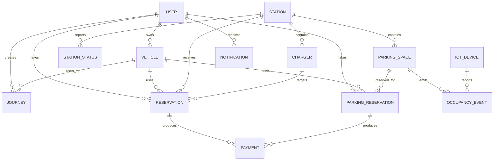

# Entity Relationship Diagram

```mermaid
erDiagram
    USER ||--o{ VEHICLE : owns
    USER ||--o{ JOURNEY : creates
    VEHICLE ||--o{ JOURNEY : used_for
    STATION ||--o{ CHARGER : contains
    STATION ||--o{ STATION_STATUS : reports
    USER ||--o{ RESERVATION : makes
    VEHICLE ||--o{ RESERVATION : uses
    STATION ||--o{ RESERVATION : receives
    CHARGER ||--o{ RESERVATION : targets
    STATION ||--o{ PARKING_SPACE : contains
    USER ||--o{ PARKING_RESERVATION : makes
    VEHICLE ||--o{ PARKING_RESERVATION : uses
    PARKING_SPACE ||--o{ PARKING_RESERVATION : reserved_for
    RESERVATION ||--o{ PAYMENT : produces
    PARKING_RESERVATION ||--o{ PAYMENT : produces
    PARKING_SPACE ||--o{ OCCUPANCY_EVENT : emits
    IOT_DEVICE ||--o{ OCCUPANCY_EVENT : reports
    USER ||--o{ NOTIFICATION : receives
```
