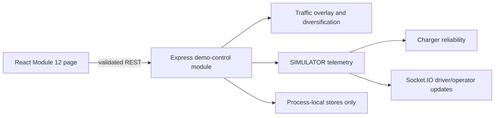

# Module 12 handoff — demo and simulation control

## Status

Module 12 is complete at the documented P0 demo boundary. All 12 project modules now
meet P0.

## Delivered controls

- Reset all mutable process-local demo state with the explicit `RESET_DEMO` confirmation.
- Set Route A (`route-north`) traffic to HIGH.
- Set Route B (`route-central`) traffic to MEDIUM.
- Inject explicitly simulated charger `CHARGING`, `FAULT`, and restored `AVAILABLE` states.
- Run the 20-request capacity-aware diversification batch.
- Request `REAL`, `DEMO`, or `SIMULATOR` mode.
- Freeze and resume incoming telemetry/scenario mutations for screenshots.

## Architecture

The React admin page calls `/api/v1/admin/demo`. Zod validates every mutation. The
Express admin service orchestrates existing traffic, telemetry, reliability,
recommendation, reservation, payment, occupancy, and access stores. Pure traffic
algorithms stay in the intelligence package; mutable scenario overlays stay in the API.

## Safety and honesty

- Reset does not alter PostgreSQL or migrations.
- Scenario buttons do not publish raw MQTT commands or expose broker credentials.
- Charger actions are labelled `SIMULATOR` and control no high-voltage hardware.
- A requested REAL mode reports `effectiveMode: DEMO` until a verified live provider exists.
- Freeze suppresses incoming telemetry updates and blocks scenario mutations until resumed.

## Validation

- Five focused Module 12 API integration tests cover mode fallback, traffic overrides,
  charger state changes, freeze/resume, vehicle batch, and reset confirmation.
- Full workspace typecheck passed.
- All 99 automated tests passed, including the five Module 12 integration tests.
- Full production build and rendered browser smoke checks passed.
- Vite reports a non-blocking main-bundle size warning; further route-level splitting is
  recommended during production optimization.

## Remaining hardening

- Require authenticated admin authorization before non-demo deployment.
- Add Playwright golden-path and fault-reroute coverage.
- Replace process-local stores only when durable domain schemas and migrations are approved.
